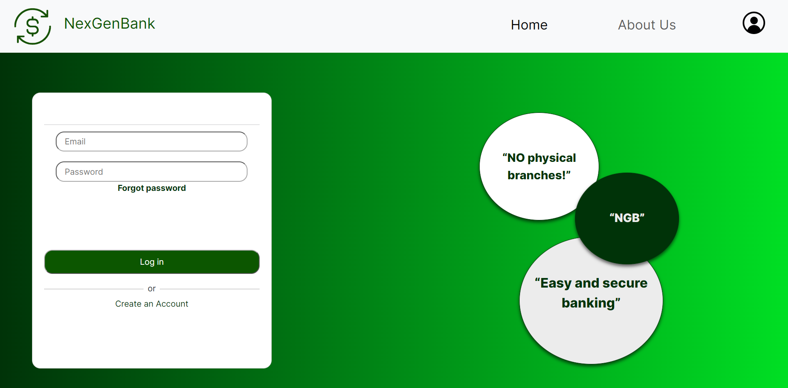
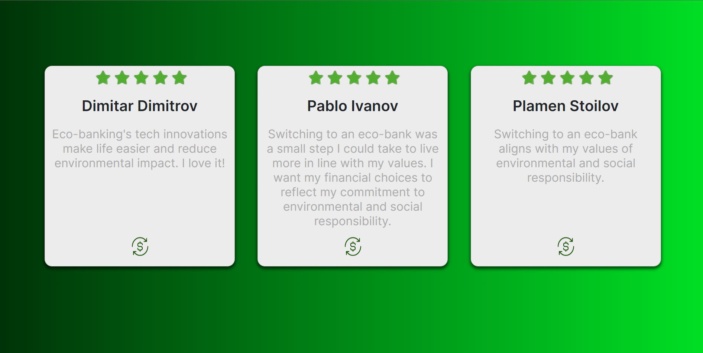
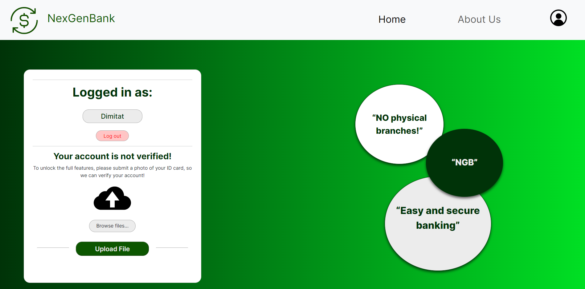
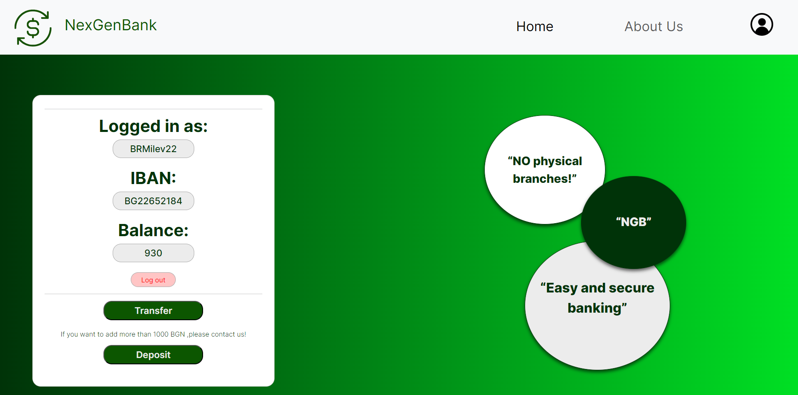

<h1 align = "center">NexGenBank</h1>

    

    <h4 align="center">We are NexGenBank and we want to show you our site</h4>
    

    

    
    
    
    
    
  

 

<!-- TABLE OF CONTENTS -->
<h2 id="table-of-contents">Table of Contents</h2>
    

    
Table of Contents

    <li><a href="#about-the-project">  The Project</a></li>
    <li><a href="#used-technologies">  Technologies</a></li>
    <li><a href="#contributors">   Contributors</a></li>
    <li><a href="#download">    Download</a></li>

 [-----------------------------------------------------](https://raw.githubusercontent.com/andreasbm/readme/master/assets/lines/rainbow.png)
    
<!-- ABOUT THE PROJECT -->
<h2 id="about-the-project">About The Project</h2>
    

    NexGenBank is a collaborative project developed by a passionate team of software engineers and financial experts. Our mission is to revolutionize the banking experience by leveraging the latest technologies to provide secure, efficient, and user-friendly financial services.

 - The NexGenBank Team ❤️

Screenshots

Show

 
    
    
|                             Home page                                   |                               Ratings                                |
| :-------------------------------------------------------------------: | :--------------------------------------------------------------------: |
|
 |  |  

|                             Logged not verified                            |                        Logged verified                            |
| :-------------------------------------------------------------------: | :--------------------------------------------------------------------: |
|
 | 

    

    
</td></tr></table>

    

    
##  Used technologies

-  <a href="https://code.visualstudio.com/">Visual Studio Code</a>
-  <a href="https://github.com/">GitHub</a>
-  <a href="https://discord.com/">Discord</a>
-  <a href="https://en.wikipedia.org/wiki/Microsoft_Word">MS Word</a>

-  <a href="https://bg.wikipedia.org/wiki/Microsoft_PowerPoint">MS PowerPoint</a>
-  <a href="https://www.microsoft.com/en-us/microsoft-teams/group-chat-software">MS Teams</a>
-----------------------------------------------------------------------------------------------------------------------------------
- 👩🏻‍💻 Programing languages: <a href="https://en.wikipedia.org/wiki/HTML">Html</a>  <a href="https://en.wikipedia.org/wiki/CSS">Css</a>  <a href="https://en.wikipedia.org/wiki/PHP">PHP</a>  <a href="https://en.wikipedia.org/wiki/JavaScript">JS</a>
    
    

<h3>Contributors</h3>

<ol>
    <li>
        <strong>Dimitar Kostadinov</strong>
        <ul>
            <li>Role: Scrum Trainer</li>
            <li>GitHub: <a href="https://github.com/DKKostadinov22">DKKostadinov22</a></li>
        </ul>
    </li>
    
<li>
            <strong>Dimitar Dimitrakov</strong>
<ul>
            <li>Role: Front-end Developer</li>
            <li>GitHub: <a href="https://github.com/DPDimitrakov22">DPDimitrakov22</a></li>
</ul>
</li>

<li>
<strong>Boris Milev</strong>
<ul>
            <li>Role: Back-end Developer</li>
            <li>GitHub: <a href="https://github.com/BRMilev22">BRMilev22</a></li>
</ul>
</li>
        
<li>
<strong>Plamen Petkov</strong>
<ul>
            <li>Role: Designer</li>
            <li>GitHub: <a href="https://github.com/PRPetkov22">PRPetkov22</a></li>
</ul>
</li>
    
</ol>

<h3>Features</h3>
<li>
    <strong>Paperless Operations:</trong>
      <ul>- Ensure that all transactions, statements, and communications are conducted electronically, minimizing the use of paper. Encourage customers to opt for e-statements and digital receipts.</ul>
</li>
    <li>
        <strong>Carbon-Neutral Operations:</strong>
           <ul>-Offset the carbon footprint generated by your digital infrastructure, such as servers and data centers, by investing in renewable energy sources or participating in carbon offset programs.</ul>
    </li>
<li>
  <strong>Green Banking Products:</strong>
        <ul>-Offer incentives or discounts for customers who choose eco-friendly options like investing in green businesses, using electric vehicles, or purchasing eco-friendly products. Create specific savings or investment products that support sustainable initiatives.</ul>
</li>
<li>
  <strong> Virtual Services:</strong>
        <ul>-As you don't have physical branches, emphasize the use of online and mobile banking services, reducing the need for customers to travel to physical locations, thus lowering carbon emissions.</ul>
</li>    
 <h2 id="instalation">Instalation</h2>
    
<pre>https://github.com/DKKostadinov22/NexGenBank.git</pre>
    
<h3 align="center"> Thank you and enjoy our site! <h3>
<h4 align="center"> Made with ❤️</h4>

<h4 align="center"> Created by team NexGenBank | &copy 2023 All rights reserved.</h4>
<h1 align="center">Thanks for checking out our repo, show us some ❤️ by giving our repo a ⭐️!</h1>